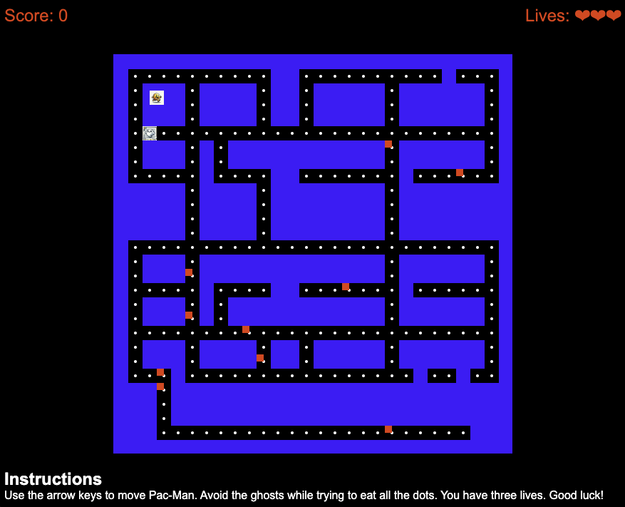

# Pac-Man Game Project

## Table of Contents
- [Pac-Man Game Project](#pac-man-game-project)
  - [Table of Contents](#table-of-contents)
  - [Overview](#overview)
  - [Features](#features)
  - [Screenshots](#screenshots)
  - [File Structure](#file-structure)
    - [index.html](#indexhtml)
    - [styles/main.css](#stylesmaincss)
    - [scripts/app.js](#scriptsappjs)
  - [Setup and Usage](#setup-and-usage)
  - [Enhancements](#enhancements)

## Overview
This project is a web-based rendition of the classic Pac-Man game. It utilizes HTML, CSS, and JavaScript to create an interactive gaming experience where the player controls Pac-Man, navigating through a maze to eat dots while avoiding ghosts.

## Features
- A maze that resembles the classic Pac-Man game layout.
- Pac-Man character that the player can move with arrow keys.
- Ghosts that chase Pac-Man.
- Dots for Pac-Man to eat and gain points.
- Special food items that give Pac-Man extra points.
- Three lives for Pac-Man. If a ghost catches Pac-Man, a life is deducted.
  
## Screenshots


## File Structure
```plaintext
Pac-Man Game
│
├── index.html # Main HTML file for the game.
│
├── styles
│       └── main.css # CSS styles for the game.
│
└── scripts
│        └──app.js # JavaScript logic for the game functionality.
│
└── images
        └──ghost.png # ghost image for the game
        └──pacman.png # ghost image for the game

```

### index.html
Contains the structure of the game, including the game board and score display.

### styles/main.css
Defines the styling for the game, including the layout of the game board, Pac-Man, ghosts, walls, and dots. It also includes styles for the score display and instructions.

### scripts/app.js
Contains the JavaScript logic for the game's functionality. This includes moving Pac-Man and the ghosts, checking for collisions, and updating the score and lives.

## Setup and Usage

1. Clone or download the project to your local machine.
2. Open the `index.html` file in a web browser to start the game.
3. Use the arrow keys to move Pac-Man through the maze.
4. The game's objective is to eat all the dots without getting caught by the ghosts.

You can also play the game online by visiting [Pac-Man](https://dinulhaque89.github.io/SEB-Project-1/).

## Enhancements
- The ghost AI has been enhanced to chase Pac-Man instead of moving randomly.
- Pac-Man has three lives. If caught by a ghost, one life is deducted.
